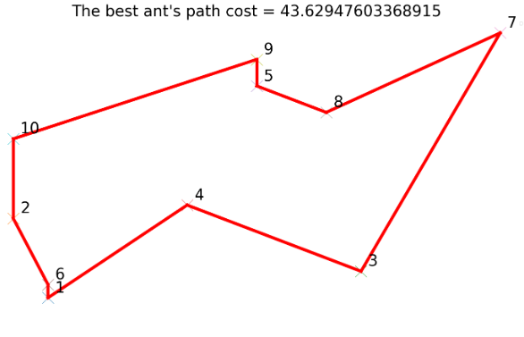

# Ant System Colony for the Traveling Salesman Problem

The Ant System Colony algorithm can be effectively applied to solve the Traveling Salesman Problem (TSP). The TSP involves finding the shortest possible route for a salesman to visit a set of cities, returning to the starting city after visiting all the others. By simulating the behavior of ants, the algorithm can explore and optimize potential solutions for the TSP.

## Introduction

The Traveling Salesman Problem is a well-known optimization problem in which a salesman needs to determine the shortest possible route to visit a given set of cities exactly once and return to the starting city. The challenge lies in finding an optimal solution that minimizes the total distance traveled.

The Ant System Colony algorithm tackles this problem by mimicking the foraging behavior of ants. Just as real ants deposit and follow pheromone trails to find the shortest paths, the simulated ants in the algorithm create and reinforce trails on the graph representing the cities. The pheromone concentration on an edge is used as a heuristic to guide the ants in their decision-making process.

## Algorithm Steps

1. **Initialization**: Create an initial population of ants, each representing a potential solution (a tour).
2. **Local Exploration**: Each ant constructs a complete tour by probabilistically selecting the next city to visit based on the pheromone levels and distances.
3. **Update Pheromones**: After all ants have completed their tours, update the pheromone levels on the edges based on the quality of the solutions.
4. **Global Update**: Enhance the pheromone levels on the edges of the best tour found so far.
5. **Evaporation**: Reduce the pheromone levels on all edges to prevent stagnation.
6. **Termination**: Repeat steps  until a termination criterion is met - a maximum number of iterations.
7. **Best Solution**: The best tour found during the iterations represents the optimized solution for the Traveling Salesman Problem.

## Repository Structure

- **/src**: Contains the source code implementation of the Ant System Colony algorithm for the TSP.
- **/tests**: Includes test cases to validate the correctness and efficiency of the algorithm.
- **/README.md**: The current file, providing an overview of the Ant System Colony algorithm for the TSP.

## Getting Started

To use the Ant System Colony algorithm for solving the Traveling Salesman Problem, follow these steps:

1. Clone the repository: `git clone https://github.com/adamsoja1/Ant-System-Salesman-Problem`.
2. Navigate to the project directory: `cd Ant-System-Salesman-Problem`.
3. Install requirements to your python environment: ```pip install -r requirements.txt```.
4. Modify cities_4.txt file to fit your x,y coordinates.
5. Customize the algorithm parameters and components to fit your specific TSP instance.
6. Run the algorithm: ```python3 src/ants_travel.py ``` or in spyder/jupyter and analyze the results.

## Run with docker

To run the Ant System Colony algorithm for solving the Traveling Salesman Problem in docker, follow these steps:

1. Clone the repository: `git clone https://github.com/adamsoja1/Ant-System-Salesman-Problem`.
2. Navigate to main directory: `cd Ant-System-Salesman-Problem`.
3. Modify cities_4.txt file to fit your x,y coordinates.
4. Customize the algorithm parameters and components to fit your specific TSP instance.
5. Type in command window: ```docker build -t ants . ``` 
6. On UNIX systems type: ```docker run -v $PWD:/code ants```, on windows: ```docker run -v %cd%:/code ants```


## Example of single run for specific cities coordinates

### Coordinates
**x**: [3 2 12 7  9  3 16 11 9 2]

**y**: [1 4 2 4.5 9 1.5 11 8 10 7]

### Results

Best route 




Best route with other routes traveled by ants


##  Tests

To run tests, run the following command

 ```bash 
 pytest -v
 ```

You should see the following result:


## Technologies used

**Programming language:** Python

**Libraries:** Numpy, Matplotlib

## Authors

\- [@adamsoja1](https://github.com/adamsoja1)

